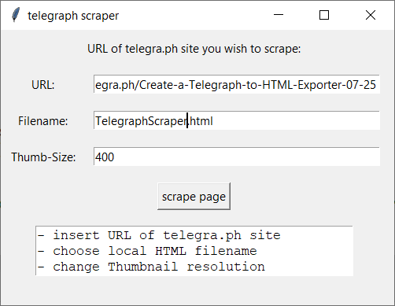

# telegra.ph-scraper
Load HTML and images from a telegra.ph post and saves the data to local harddrive. You can change the python file to your needs. I use it to scrape my telegra.ph posts and put them as plain html code to my website: [www.unsere-schule.org](https://www.unsere-schule.org)

## Python modules used:
- [Beautiful Soup 4](https://www.crummy.com/software/BeautifulSoup/bs4/doc/) for parsing HTML. (pip install beautifulsoup4)
- [Requests](https://requests.readthedocs.io/en/master/) to download data from website. (clone repo and install with pip) 
- [Pillow](https://pypi.org/project/Pillow/) for image rezising. (pip install Pillow)
- re for using Regular Expressions.
- urllib.request to download images from the website.
- os to create a new folder for the downloaded images.

## Functions:
- load all HTML from entered telegra.ph URL
- load all images from entered telegra.ph URL and saves them to a "/images/" folder
- resize alle images to a specific value -> you have both images lowres and normal res
- add style to img tags for responsiveness
- use regular expression to get view code of embedded youtube videos and create new iframe container

!Info: Use Youtube videos in your telegra.ph post with the standard URL, like https://www.youtube.com/watch?v=UsTLJlPvVvE. The regular expression searches for "?v=".

[Link to telegra.ph article](https://telegra.ph/Create-a-Telegraph-to-HTML-Exporter-07-25) for some additional informations.
