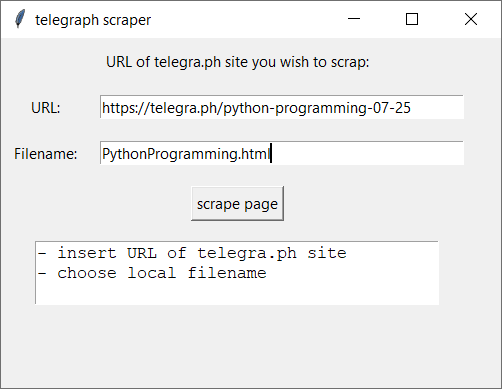

# telegra.ph-scraper
Load HTML and images from a telegra.ph post and saves the data to local harddrive. You can change the python file to suit your needs. I use it to scrape my telegra.ph posts and put them as plain html code to my website: [www.unsere-schule.org](www.unsere-schule.org)

